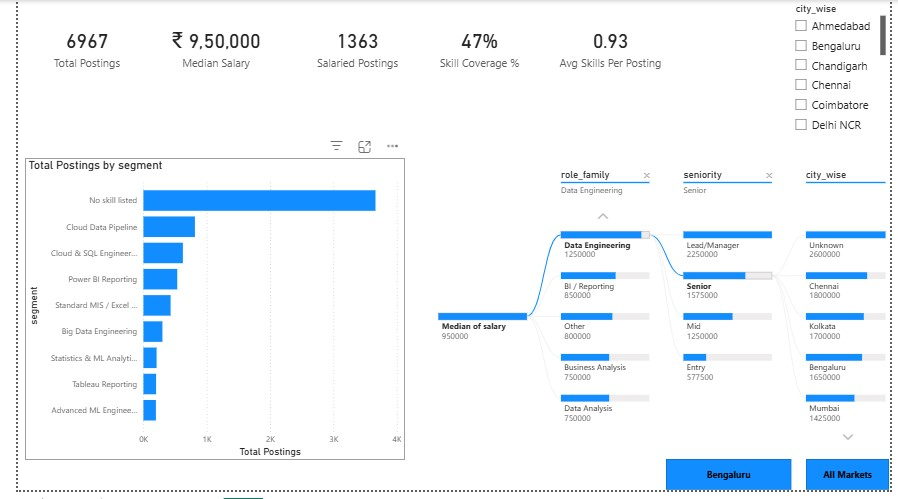
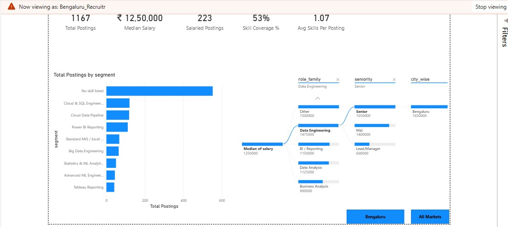
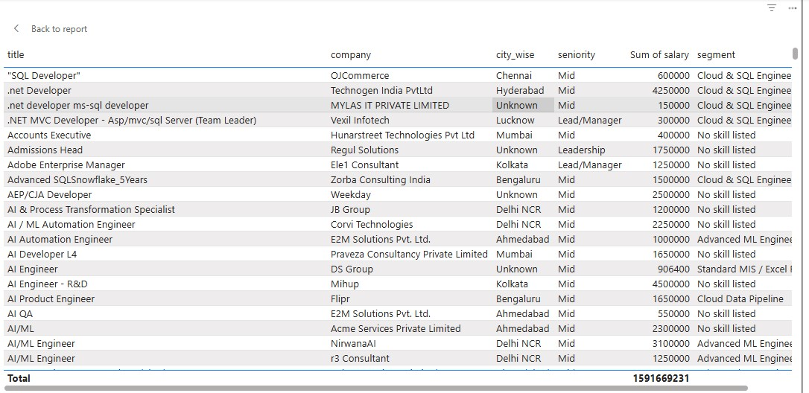

# Indian Analytics Job Market Intelligence

An end-to-end data project on India's analytics job market. It collects live postings from the Adzuna Jobs API, cleans and enriches them with pandas, measures which skills carry a salary premium, segments the market into role archetypes with K-Means, and presents the results in a Power BI dashboard.

Built as the capstone project for the Internshala Data Science PGC program.

   

---

## Questions this project answers

1. Which skills actually carry a salary premium in Indian analytics hiring, and which are just table stakes?
2. How does advertised pay vary by city and seniority?
3. What distinct kinds of analytics roles exist in the market?

## Key findings

| | Result |
|---|---|
| Postings analysed | **6,967** unique Indian postings |
| Salary disclosure | Only **19.6%** (1,363 postings) state a salary |
| Biggest skill premium | **Machine Learning: +83%** (median ₹16.5L with ML vs ₹9L without) |
| Biggest skill discount | **Excel: −30%** (median ₹7L vs ₹10L) |
| Highest-paying city | **Bengaluru**, median ₹12.5L (Ahmedabad lowest at ₹6L) |
| Largest role family | **Data Analysis**, 1,890 postings |
| Market segments | **8** role archetypes, median pay from ₹6.5L to ₹15L |

**Demand and premium are different things.** Excel appears in 554 postings but is linked to *lower* pay, because it dominates MIS and entry-level reporting roles. Machine Learning appears in only 262 postings yet carries the largest premium. Engineering skills (ETL +53%, Cloud +50%, Big Data +44%) sit close behind.

### Skill premium (median advertised salary, postings with vs without the skill)

| Skill | Postings | With skill | Without | Premium |
|---|---:|---:|---:|---:|
| Machine Learning | 262 | ₹16.5L | ₹9.0L | +83.3% |
| ETL | 741 | ₹13.0L | ₹8.5L | +52.9% |
| Cloud | 1,239 | ₹12.75L | ₹8.5L | +50.0% |
| Big Data | 333 | ₹13.0L | ₹9.0L | +44.4% |
| Statistics | 232 | ₹12.5L | ₹9.0L | +38.9% |
| Python | 638 | ₹12.5L | ₹9.0L | +38.9% |
| SQL | 1,088 | ₹11.0L | ₹8.5L | +29.4% |
| Power BI | 452 | ₹11.0L | ₹9.0L | +22.2% |
| Tableau | 200 | ₹10.0L | ₹9.5L | +5.3% |
| Visualisation | 714 | ₹9.06L | ₹9.5L | −4.6% |
| Excel | 554 | ₹7.0L | ₹10.0L | −30.0% |

### Pay by city and seniority

Only cities with at least 30 salaried postings are shown, so each median is reliable. Median pay rises steadily with seniority, from ₹4L at entry level to ₹22.5L in leadership roles.

### Market segments (K-Means, k = 8)

| Segment | Postings | Median salary | Defining skills |
|---|---:|---:|---|
| Advanced ML Engineering | 197 | ₹15.0L | ML, Cloud, Python |
| Cloud Data Pipeline | 813 | ₹14.5L | Cloud, ETL, Python |
| Big Data Engineering | 300 | ₹13.0L | Big Data, Cloud, SQL |
| Statistics & ML Analytics | 208 | ₹12.75L | Statistics, ML, Python |
| Cloud & SQL Engineering | 623 | ₹10.9L | SQL, Cloud, ETL |
| Power BI Reporting | 534 | ₹10.0L | Visualisation, Power BI, SQL |
| Tableau Reporting | 200 | ₹10.0L | Tableau, Visualisation, SQL |
| Standard MIS / Excel Reporting | 429 | ₹6.5L | Excel, SQL, Visualisation |

---

## Power BI dashboard



The overview page shows KPI cards, the segment breakdown, and a Decomposition Tree that drills median salary down by role family, then seniority, then city. Bookmark buttons switch between the Bengaluru view and all markets.



Row-Level Security limits a recruiter role to its own city. In the Bengaluru view, every figure recalculates to that city's 1,167 postings.



A drill-through page lists the individual postings behind any segment.

---

## Method

**1. Data collection.** Postings come from the official Adzuna Jobs API (`country = "in"`), the permitted access route for this data. A national pass runs 14 analytics search terms. A second pass queries 10 major cities directly, because a single national query cannot page deep enough on its own. BeautifulSoup strips HTML from the job descriptions.

**2. Location cleaning.** The same market shows up under many names: Gurgaon, Noida and Ghaziabad are all Delhi NCR, and Bangalore and Bengaluru are the same city. City, full location and region are combined into one searchable field, which recovers postings whose `city` field was empty. Cities are then mapped to hiring markets and tiered. Tier 1 follows the government HRA "X" city classification.

**3. Feature engineering.** The notebook creates 11 skill flags from keyword matching on title and description. It also derives a skill count, a seniority level (Entry → Leadership) and a role family (Data Analysis, Business Analysis, BI/Reporting, Data Engineering, Data Science/ML) from job titles.

**4. Analysis.**
- **Skill premium:** the median salary of postings that mention each skill, compared with postings that don't.
- **Pay by city and seniority.**
- **Role-family demand.**
- **Correlation heatmap:** shows which skills co-occur and how each one relates to salary.

**5. Segmentation.** K-Means clustering runs on standardised skill flags for the 3,304 postings that mention at least one skill. k was chosen by silhouette score across k = 2–8, and k = 8 scored highest (0.38). Each cluster is named from its most frequent skills.

**6. Dashboard.** A Power BI report is built on the exported dataset (see *Power BI dashboard* above).

### Why there is no salary prediction model
Only about one in five postings discloses pay, and early regression tests gave a cross-validated R² close to zero. A model that cannot beat a simple average would be misleading. The project therefore reports direct, explainable comparisons (median premiums, segment medians) instead.

---

## Repository structure

```
├── Indian_Analytics_Job_Market_Intelligence.ipynb   # full pipeline: extraction → cleaning → analysis → clustering
├── cleaned_job_postings.csv                         # cleaned, feature-engineered dataset
├── Capstone_Report.pdf                              # full project report
├── Dashboard/                                       # Power BI dashboard screenshots
├── requirements.txt
└── LICENSE
```

## How to run

1. Open the notebook in **Google Colab**.
2. Get free API keys at [developer.adzuna.com](https://developer.adzuna.com).
3. In Colab, open **Secrets** (key icon in the left sidebar) and add two secrets: `ADZUNA_APP_ID` and `ADZUNA_APP_KEY`.
4. Run all cells. Extraction takes a few minutes and stays within the free API tier.

The raw API download is not committed to this repository. Run the extraction cells to regenerate it.

## Limitations

- **Advertised salary is not offered salary.** About 80% of postings show no pay at all.
- **Snapshot in time.** The data covers a few weeks of postings, too short to show hiring trends.
- **Rule-based labels.** Skills, seniority and role family come from keyword matching, so unusual job titles can be misclassified.
- **Unlocated postings.** 1,569 postings could not be placed in a city because Adzuna records only "India" for them.

## Tech stack

Python · pandas · requests · BeautifulSoup · scikit-learn · matplotlib · seaborn · Google Colab · Power BI (DAX)

## Author

**Rahul**, Computer Science graduate (DIT University) and aspiring Data Analyst.

## License

Code is released under the MIT License. Job posting data belongs to Adzuna and the original employers.
